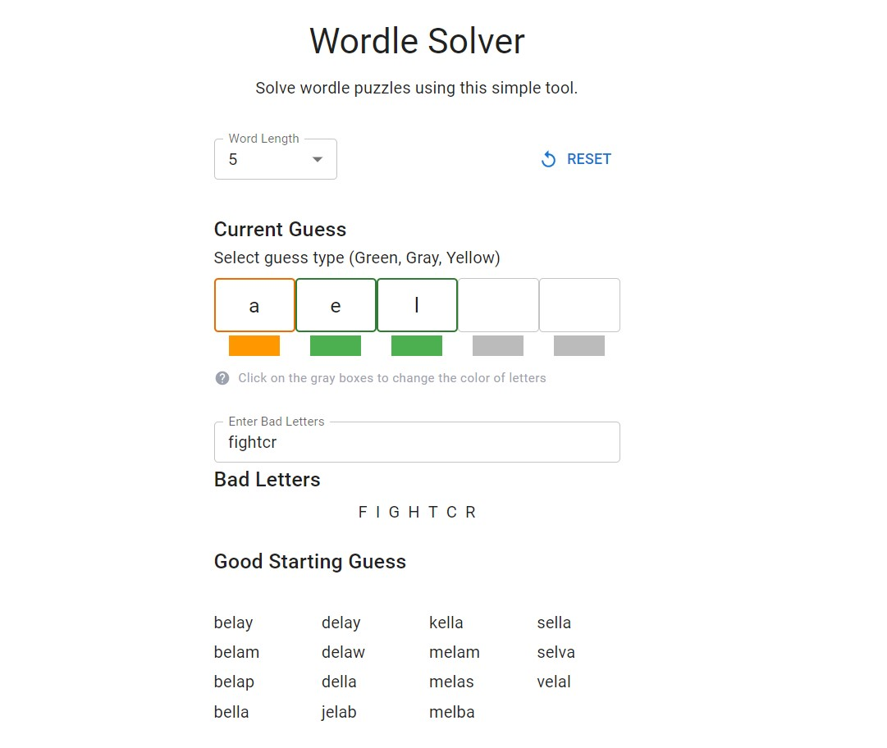

# Wordle Solver

## Description
A simple program that solves wordle puzzles. Built using React Typescript and Material-UI.

## Project Live Link
[https://wordle-solver.webrace.com/](https://wordle-solver.webrace.com/)

<!-- add image -->



## Installation
```bash
npm install
```


## Usage
```bash
npm start
```